# Mac Health Check: Deployment Workflow

This diagram provides a step-by-step guide for deploying the `4.0.0b23` release of Mac Health Check through an MDM solution. Follow the phases in order for a successful deployment.

```mermaid
graph TB
    START(["🚀 Begin Deployment"])

    subgraph Phase1["Phase 1: Prerequisites"]
        P1A["Confirm MDM solution<br>Jamf Pro · Kandji · Intune · Mosyle<br>JumpCloud · Addigy · Filewave · Fleet"]
        P1B["Confirm prerequisites<br>jq required; swiftDialog<br>preinstalled or installable"]
        P1C["Download Mac-Health-Check.zsh<br>from GitHub repository"]

        START --> P1A
        P1A --> P1B
        P1B --> P1C

        style P1A fill:#b2dfdb
        style P1B fill:#b2dfdb
        style P1C fill:#b2dfdb
    end

    subgraph Phase2["Phase 2: Script Customization"]
        P2A["Edit Organization + Support Defaults<br>(branding, Dock, thresholds, contacts)"]
        P2B["Set branding and Dock behavior<br>organizationBrandingBannerURL<br>organizationOverlayiconURL<br>enableDockIntegration · dockIcon"]
        P2C["Set operational thresholds<br>vpnClientVendor · organizationFirewall<br>allowedUptimeMinutes<br>allowedMinimumFreeDiskPercentage"]
        P2D["Set support links and labels<br>supportTeam* or supportLabelN/valueN"]

        P1C --> P2A
        P2A --> P2B
        P2A --> P2C
        P2A --> P2D

        style P2A fill:#f3e5f5
        style P2B fill:#f3e5f5
        style P2C fill:#f3e5f5
        style P2D fill:#f3e5f5
    end

    subgraph Phase3["Phase 3: External Checks (Optional)"]
        P3Q{"Deploy external<br>security tool checks?"}
        P3A["Upload external-checks/ scripts<br>to MDM as separate policies"]
        P3B["Set organizationDefaultsDomain<br>to match MDM policy domain"]
        P3SKIP["Skip — use built-in checks only"]

        P2B --> P3Q
        P2C --> P3Q
        P2D --> P3Q
        P3Q -->|Yes| P3A
        P3A --> P3B
        P3Q -->|No| P3SKIP

        style P3Q fill:#ffecb3
        style P3A fill:#fff4e6
        style P3B fill:#fff4e6
        style P3SKIP fill:#cfd8dc
    end

    subgraph Phase4["Phase 4: MDM Upload"]
        P4A["Upload Mac-Health-Check.zsh<br>to MDM as a script"]
        P4B["Set Parameter 4<br>operationMode = 'Self Service'"]
        P4C["Set Parameter 5 (optional)<br>webhookURL = Teams/Slack URL"]

        P3B --> P4A
        P3SKIP --> P4A
        P4A --> P4B
        P4A --> P4C

        style P4A fill:#c8e6c9
        style P4B fill:#c8e6c9
        style P4C fill:#c8e6c9
    end

    subgraph Phase5["Phase 5: Self Service Policy"]
        P5A["Create MDM policy<br>Assign Mac-Health-Check.zsh"]
        P5B["Configure Self Service display<br>Name, description, icon"]
        P5C["Assign scope<br>Target devices / groups"]
        P5D["Publish policy"]

        P4B --> P5A
        P4C --> P5A
        P5A --> P5B
        P5B --> P5C
        P5C --> P5D

        style P5A fill:#c8e6c9
        style P5B fill:#c8e6c9
        style P5C fill:#c8e6c9
        style P5D fill:#c8e6c9
    end

    subgraph Phase6["Phase 6: Silent + Client-Side Cache (Optional)"]
        P6Q{"Deploy recurring<br>silent reporting?"}
        P6A["Create Jamf upload policy<br>Parameter 4 = 'Silent'<br>Parameter 6 = 'production'"]
        P6B["Client LaunchDaemon refreshes<br>local report in a deterministic 00:53-01:53 window centered on 1:23 a.m.<br>No RunAtLoad"]
        P6C["Assign scope &amp; publish"]
        P6SKIP2["Skip recurring silent reporting"]

        P5D --> P6Q
        P6Q -->|Yes| P6A
        P6A --> P6B
        P6B --> P6C
        P6Q -->|No| P6SKIP2

        style P6Q fill:#ffecb3
        style P6A fill:#fff4e6
        style P6B fill:#fff4e6
        style P6C fill:#fff4e6
        style P6SKIP2 fill:#cfd8dc
    end

    subgraph Phase7["Phase 7: Testing"]
        P7A["Run in Debug mode<br>Parameter 4 = 'Debug'<br>Review set -x output"]
        P7B["Run in Development mode<br>Parameter 4 = 'Development'<br>Exercise AirDrop, Entra ID Registration, and Wi-Fi Strength"]
        P7C["Run in Test mode<br>Parameter 4 = 'Test'<br>Validate full vendor UI with simulated success"]
        P7D{"All checks<br>render correctly?"}
        P7FIX["Review configuration<br>and re-test"]

        P6C --> P7A
        P6SKIP2 --> P7A
        P7A --> P7B
        P7B --> P7C
        P7C --> P7D
        P7D -->|No| P7FIX
        P7FIX --> P7A
        P7D -->|Yes| P8

        style P7A fill:#fff4e6
        style P7B fill:#fff4e6
        style P7C fill:#fff4e6
        style P7D fill:#ffecb3
        style P7FIX fill:#ffcdd2
    end

    subgraph Phase8["Phase 8: Production &amp; Monitoring"]
        P8["Promote to production scope"]
        P8A["Monitor /var/log/org.churchofjesuschrist.log<br>Review structured log output"]
        P8B["Review webhook alerts<br>(if configured)"]
        P8C["Validate Dock badge and unhealthy end-state<br>on non-Silent runs"]
        P8D["Check MDM inventory<br>for compliance trends"]

        P8 --> P8A
        P8 --> P8B
        P8 --> P8C
        P8 --> P8D

        style P8 fill:#c8e6c9
        style P8A fill:#c8e6c9
        style P8B fill:#c8e6c9
        style P8C fill:#c8e6c9
        style P8D fill:#c8e6c9
    end

    classDef default font-size:11px
```

---

## Detailed Step-by-Step Guide

### Phase 1: Prerequisites

Before deploying Mac Health Check, confirm:

- [ ] An MDM solution is in place (Jamf Pro, Kandji, Microsoft Intune, Mosyle, JumpCloud, Addigy, Filewave, or Fleet)
- [ ] `jq` is present on target Macs that do not already bundle it
- [ ] `swiftDialog` is approved for your environment and is either preinstalled or allowed to auto-install/update
- [ ] You have downloaded the latest `Mac-Health-Check.zsh` from the [GitHub repository](https://github.com/dan-snelson/Mac-Health-Check)

---

### Phase 2: Script Customization

Open `Mac-Health-Check.zsh` and review the **Organization Variables** and **IT Support Variables** sections.

**Required changes:**
| Variable | What to Set |
|---|---|
| `organizationBrandingBannerURL` | Your organization's banner image URL |
| `organizationOverlayiconURL` | Your MDM self-service app icon path or URL |
| `enableDockIntegration` / `dockIcon` | Whether to show Dock integration in non-`Silent` modes and which icon to use |
| `vpnClientVendor` | `paloalto`, `cisco`, `tailscale`, or `none` |
| `organizationFirewall` | `socketfilterfw` (most orgs) or `pf` |
| `supportLabel1` / `supportValue1` (and additional pairs as needed) | Dynamic support lines and the first URL-like action for the Info button |

**Optional changes:**
| Variable | Default | Description |
|---|---|---|
| `allowedUptimeMinutes` | `10080` (7 days) | Uptime warning threshold |
| `allowedMinimumFreeDiskPercentage` | `10` | Free disk error threshold |
| `previousMinorOS` | `2` | How many older macOS versions are compliant |
| `completionTimer` | `60` | Fallback dialog auto-close (seconds) |

`webhookURL` is configured as **Parameter 5** in the MDM policy, not as a long-lived script default. Splunk reporting is likewise enabled through runtime parameters rather than hard-coded tokens in the script.

---

### Phase 3: External Checks (Optional, Jamf Pro Only)

If your organization uses BeyondTrust, Cisco Umbrella, CrowdStrike, or GlobalProtect:

1. Review the scripts in `external-checks/` and customize as needed
2. Upload each external check script to Jamf Pro with its trigger name (e.g., `symvCrowdStrikeFalcon`)
3. Set `organizationDefaultsDomain` in `Mac-Health-Check.zsh` to match the domain used by external check policies
4. Ensure `checkExternalJamfPro` calls at the bottom of the Jamf Pro check set reference the correct trigger names

---

### Phase 4: MDM Upload

1. Upload the customized `Mac-Health-Check.zsh` to your MDM as a script
2. Configure the script parameters:
   - **Parameter 4** — Operation mode (start with `Debug` for initial testing)
   - **Parameter 5** — Webhook URL (optional)
    - **Parameters 6-11** — Splunk reporting mode, HEC URL, HEC token, HEC index, HEC sourcetype, and reporting debug mode

---

### Phase 5: Self Service Policy

Create an MDM policy with:
- **Script:** `Mac-Health-Check.zsh`, Parameter 4 = `Self Service`
- **Self Service:** Enabled with a descriptive name, icon, and category
- **Scope:** Start with a test group; expand to full fleet after validation

---

### Phase 6: Silent Mode Policy and Client-Side Cache (Optional)

For background compliance monitoring, create a second policy:
- **Script:** `Mac-Health-Check.zsh`, Parameter 4 = `Silent`, Parameter 6 = `production`
- **Trigger:** Login, recurring check-in, or scheduled
- **No Self Service entry** — runs silently in the background
- **Splunk parameters:** Provide HEC URL/token/index/sourcetype from Jamf Pro policy parameters only
- **Client-Side Cache:** Non-`Silent` runs and full Jamf production runs install `/Library/Management/org.churchofjesuschrist/MHC.zsh` plus `org.churchofjesuschrist.MHC`; the script validates and loads a root LaunchDaemon without `RunAtLoad`, routes daemon stdout/stderr to `/dev/null`, and the client-side LaunchDaemon refreshes the local JSON report nightly with deterministic per-Mac jitter across 00:53-01:53 without uploading to Splunk
- When Jamf Pro runs `Silent` + `production`, matching client/server versions and a valid report under 36 hours old allow cached upload without re-running health checks
- Expect two common timestamps in healthy production telemetry: an overnight full `Silent` refresh that writes fresh local JSON, then a later Jamf `Silent` + `production` policy that uploads that cached JSON without re-running checks

---

### Phase 7: Testing

Use the three developer-oriented modes to validate behavior before rolling out to all users:

| Mode | Purpose | How to Use |
|---|---|---|
| `Debug` | Shell tracing (`set -x`) for troubleshooting | Run policy and review MDM logs |
| `Development` | Exercise only `checkWiFiStrength()` in normal dialog flow | Set Parameter 4 to `Development` |
| `Test` | Build the full current vendor list and mark each item successful without running the real checks | Validate UI layout and messages |

---

### Phase 8: Monitoring

After production deployment, monitor:

- **Client logs** at `/var/log/org.churchofjesuschrist.log` on managed Macs — look for `[WARNING]` and `[ERROR]` entries
- **Client-Side Cache assets** — confirm `/Library/Management/org.churchofjesuschrist/MHC.zsh`, `/Library/LaunchDaemons/org.churchofjesuschrist.MHC.plist`, and `/var/tmp/MacHealthCheck-Report.json` exist on test Macs
- **LaunchDaemon jitter** — confirm the plist starts at 00:53, does not include `RunAtLoad`, and the client log records `Client-Side Cache: Jitter offset = X seconds` during daemon-triggered runs
- **Fresh-write marker** — confirm full runs log `Splunk Reporting: local report written to /var/tmp/MacHealthCheck-Report.json`; this is the canonical proof that new report data was generated locally
- **Cached-upload marker and age** — confirm later Jamf `Silent` + `production` uploads log `cached report is valid and <seconds>s old. Skipping health checks.` so operators can distinguish delivery time from collection time
- **Dock badge, inspect summary handoff, cached replay, and unhealthy end-state handling** on test Macs in non-`Silent` modes — confirm countdown badges update per check, `Self Service` launches the detached moveable Preset 6 guided summary with separate `Unhealthy` and `Healthy` sections during the retained main-dialog countdown when `inspectSummaryPreset="on"`, reruns replay the cached summary after pre-flight/client-side installation without re-running checks only while the cached handoff file remains younger than `inspectReplayMaximumAgeSeconds`, and failed runs now rely on the unhealthy main-dialog state plus the detached `Self Service` summary instead of a pseudo-alert notification
- **Webhook notifications** in Teams or Slack (if configured) — review failure summaries
- **MDM inventory** — Jamf Pro interactive/full runs can still trigger inventory submission, while `Silent` + Splunk production and Client-Side Cache LaunchDaemon runs skip it

---

## Deployment Checklist

- [ ] Organization and support defaults customized (branding, Dock, VPN, firewall, thresholds, contact links)
- [ ] External check scripts uploaded and triggers configured (if applicable)
- [ ] Script uploaded to MDM with correct parameters
- [ ] Self Service policy created, scoped, and published
- [ ] Tested in Debug mode — no fatal errors
- [ ] Tested in Development mode — AirDrop, Entra ID Registration, and Wi-Fi Strength behave as expected
- [ ] Tested in Test mode — UI renders correctly
- [ ] Silent mode policy created with Splunk production parameters (if desired)
- [ ] Client-Side Cache script, LaunchDaemon, and cached JSON validated on a test Mac
- [ ] Client-Side Cache jitter validated on multiple Macs; offsets differ but remain stable per Mac
- [ ] Webhook validated (if configured)
- [ ] Rolled out to full production scope
