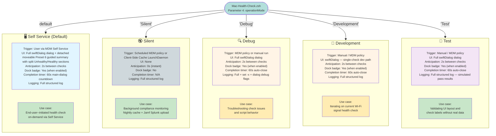

# Mac Health Check: Operation Modes

This diagram compares all five `4.0.0b23` Mac Health Check operation modes, showing how each mode differs in terms of UI, Dock behavior, logging, and intended use case.



---

## Mode Comparison Table

| Attribute | Self Service | Silent | Debug | Development | Test |
|---|---|---|---|---|---|
| **Parameter 4 value** | `Self Service` | `Silent` | `Debug` | `Development` | `Test` |
| **Is default?** | Yes | No | No | No | No |
| **swiftDialog UI** | Full dialog | None | Full dialog | Single Wi-Fi Strength check | Full dialog |
| **Anticipation delay** | 2 seconds | 0 seconds | 2 seconds | 2 seconds | 2 seconds |
| **Dock badge** | Yes (when enabled) | No | Yes (when enabled) | Yes (when enabled) | Yes (when enabled) |
| **Completion timer** | 60s on normal full runs | N/A | 60s (configurable) | 60s (configurable) | 60s (configurable) |
| **Inspect config assets** | Yes when `inspectSummaryPreset="on"` | Yes on full health-check runs when `inspectSummaryPreset="on"` | No | No | No |
| **Detached inspect summary** | Yes when `inspectSummaryPreset="on"` (moveable Preset 6) | No | No | No | No |
| **Fresh-config replay** | Yes when `inspectSummaryPreset="on"` and cache age is below `inspectReplayMaximumAgeSeconds` | No | No | No | No |
| **Logging** | Full | Full | Full + `set -x` | Full structured log | Full structured log |
| **Real check data** | Yes | Yes | Yes | Yes (Wi-Fi Strength only) | No (simulated pass results) |
| **Intended actor** | End user | Automated / Jamf policy | Administrator | Developer | Developer |

---

## Mode Details

### Self Service (Default)
The primary end-user-facing mode. Launched by a user clicking the Mac Health Check policy in MDM Self Service. Displays the full swiftDialog progress dialog with real-time status updates as each check runs. When Dock integration is enabled, the Dock badge counts down remaining checks. After report generation, normal runs launch a detached, moveable Inspect Mode Preset 6 guided summary with separate `Unhealthy` and `Healthy` sections while the main dialog still completes its existing `completionTimer` countdown. If the inspect config from a recent `Self Service` run is still valid and younger than `inspectReplayMaximumAgeSeconds`, rerunning the script replays the cached inspect summary after pre-flight/client-side installation and skips the health-check run plus the main dialog countdown. Set `inspectSummaryPreset="on"` to keep those Preset 6 behaviors enabled, or `off` to keep the standard completion flow only.

**When to use:** Standard deployment for user-initiated compliance checks.

---

### Silent
Runs health checks without displaying any user interface. Intended for scheduled background compliance runs and Client-Side Cache nightly cache refreshes. The `anticipationDuration` is automatically set to `0` in this mode to minimize execution time. Results are written to the client log and persisted to `/var/tmp/MacHealthCheck-Report.json`. Full health-check runs also write `/var/tmp/MacHealthCheck-Inspect-Config.json` and `/var/tmp/MacHealthCheck-Inspect-Compliance.plist` when `inspectSummaryPreset="on"`, without launching swiftDialog. The exact line `Splunk Reporting: local report written to /var/tmp/MacHealthCheck-Report.json` marks a fresh full-run write. The client-side LaunchDaemon run uses `splunkOperationMode=test`, so Splunk secrets stay in Jamf Pro policy parameters. Its plist has no `RunAtLoad`, routes stdout/stderr to `/dev/null`, and scheduled runs set `launchDaemonRun=true`, causing the script to apply deterministic per-Mac jitter across the 00:53-01:53 window centered on 1:23 a.m. If no GUI user is active during that refresh, user-scoped checks fall back to loginwindow `lastUserName`. When Jamf Pro later runs `Silent` with `splunkOperationMode=production`, the script uploads the cached report without running checks if the client-side script version matches and the cache is valid and younger than 36 hours. Reviewers can identify that path by `cached report is valid and <seconds>s old. Skipping health checks.` in the log. In practice this often yields an overnight fresh-report write followed by a later-morning Jamf cached upload, so the latest Splunk delivery may contain data collected hours earlier even though the upload itself succeeded recently. Dock integration and other end-user follow-up UI are suppressed.

**When to use:** Continuous background compliance monitoring, nightly local report cache refreshes, and Jamf Pro Splunk uploads without repeating a full health-check run.

---

### Debug
Similar to Self Service, but with `set -x` tracing enabled plus swiftDialog debug launch arguments (`--verbose --resizable --debug red`). In `4.0.0b23`, Debug mode also enables pretty-printed local JSON reporting, while intentionally retaining the existing countdown-based ending instead of launching the detached inspect summary. This makes it easier to identify which part of the zsh script or dialog rendering is causing unexpected behavior.

**When to use:** Diagnosing why a specific check is failing or returning an unexpected status.

---

### Development
Runs current development subset of checks in normal non-`Silent` dialog flow. In current release, subset includes `checkAirDropSettings()`, `checkEntraIDRegistration()`, and `checkWiFiStrength()`, keeping feedback focused and fast without waiting for full vendor-specific run.

**When to use:** Tuning targeted remediation copy, Entra registration reporting, Wi-Fi signal evaluation, or dialog presentation while keeping the run far shorter than a full production policy.

---

### Test
Builds the full current vendor list item set, then marks each item as a successful simulated result without executing the real health-check functions. The UI renders like production, making this mode useful for validating dialog layout, list item labels, status icon sequencing, and the overall visual presentation.

**When to use:** Verifying UI behavior after changing dialog configuration, list item labels, or overall script structure.

---

## Setting the Operation Mode

Operation mode is set via **Parameter 4** in the MDM policy:

```
# MDM Script Parameter 4
Self Service    ← default; omit parameter to use this
Silent
Debug
Development
Test
```

For local testing, pass the mode as the fourth argument:

```bash
sudo zsh Mac-Health-Check.zsh "" "" "" "Debug"
```
