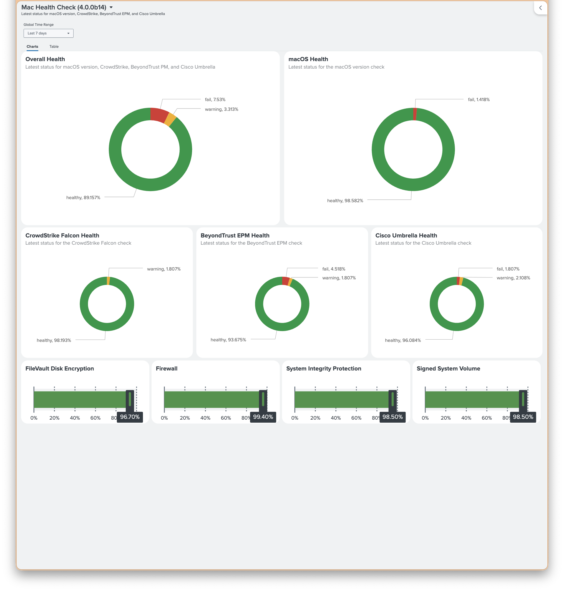

# Mac Health Check Splunk Dashboard Reference (4.0.0b15)

> 
> 
>  See: [Splunk-Mac_Health_Check_4.0.0b14-2026-04-23-132412.json](Splunk-Mac_Health_Check_4.0.0b14-2026-04-23-132412.json)

## Overview

This reference provides copy/paste SPL and dashboard examples for a focused Mac Health Check compliance panel.

Goal:

- One row per Mac
- Latest report per device inside selected time window
- Four specific checks shown as status columns
- Optional detail columns for non-healthy checks
- Failure-first sorting
- `summary.overallStatus` bonus column
- Color-coded table output for Mac Admins and Security teams

Target checks:

1. `checks.macos_version.status`
2. `checks.crowdstrike_falcon.status`
3. `checks.beyondtrust_privilege_management.status`
4. `checks.cisco_umbrella.status`

## Assumptions

Mac Health Check `4.0.0b15` writes final report JSON with these important fields:

- `metadata.timestamp`
- `metadata.hostname`
- `metadata.serialNumber`
- `systemInfo.computerName`
- `summary.overallStatus`
- `checks[]` objects with `key`, `status`, `message`, and `rawValue`

When sent to Splunk HEC, Mac Health Check wraps payload as:

```json
{
  "sourcetype": "macos:healthcheck",
  "index": "mac_health",
  "event": {
    "metadata": { ... },
    "summary": { ... },
    "checks": [ ... ]
  }
}
```

Portable SPL below handles both cases:

- direct JSON fields already extracted as `metadata.*`, `summary.*`, `checks{}`
- HEC wrapper still present as `event.metadata.*`, `event.summary.*`, `event.checks{}`

## Main SPL

Replace `index=mac_health sourcetype=macos:healthcheck` with your real Splunk values.

```spl
index=mac_health sourcetype=macos:healthcheck
| spath path=metadata.serialNumber output=serial_direct
| spath path=event.metadata.serialNumber output=serial_wrapped
| spath path=systemInfo.computerName output=computer_direct
| spath path=event.systemInfo.computerName output=computer_wrapped
| spath path=metadata.hostname output=hostname_direct
| spath path=event.metadata.hostname output=hostname_wrapped
| spath path=metadata.timestamp output=report_ts_direct
| spath path=event.metadata.timestamp output=report_ts_wrapped
| spath path=summary.overallStatus output=overall_direct
| spath path=event.summary.overallStatus output=overall_wrapped
| eval serialNumber=coalesce(serial_direct, serial_wrapped)
| eval computerName=coalesce(computer_direct, computer_wrapped)
| eval hostname=coalesce(hostname_direct, hostname_wrapped)
| eval reportTimestamp=coalesce(report_ts_direct, report_ts_wrapped)
| eval overallStatus=coalesce(overall_direct, overall_wrapped, "unknown")
| eval deviceKey=coalesce(serialNumber, computerName, hostname)
| where isnotnull(deviceKey)
| stats latest(_raw) as latestEvent
        latest(_time) as latestIngestTime
        latest(reportTimestamp) as reportTimestamp
        latest(overallStatus) as overallStatus
        latest(serialNumber) as serialNumber
        latest(computerName) as computerName
        latest(hostname) as hostname
  by deviceKey
| spath input=latestEvent path=checks{} output=checks_direct
| spath input=latestEvent path=event.checks{} output=checks_wrapped
| eval checks=mvappend(checks_direct, checks_wrapped)
| mvexpand checks
| spath input=checks path=key output=checkKey
| search checkKey IN ("macos_version","crowdstrike_falcon","beyondtrust_privilege_management","cisco_umbrella")
| spath input=checks path=status output=checkStatus
| spath input=checks path=message output=checkMessage
| spath input=checks path=rawValue output=checkRawValue
| eval checkDetail=if(checkStatus="healthy", null(), coalesce(checkMessage, checkRawValue))
| stats first(reportTimestamp) as reportTimestamp
        first(latestIngestTime) as latestIngestTime
        first(overallStatus) as overallStatus
        first(serialNumber) as serialNumber
        first(computerName) as computerName
        first(hostname) as hostname
        values(eval(if(checkKey="macos_version", checkStatus, null()))) as macosVersionStatus
        values(eval(if(checkKey="crowdstrike_falcon", checkStatus, null()))) as crowdstrikeFalconStatus
        values(eval(if(checkKey="beyondtrust_privilege_management", checkStatus, null()))) as beyondtrustPrivilegeManagementStatus
        values(eval(if(checkKey="cisco_umbrella", checkStatus, null()))) as ciscoUmbrellaStatus
        values(eval(if(checkKey="macos_version", checkDetail, null()))) as macosVersionDetail
        values(eval(if(checkKey="crowdstrike_falcon", checkDetail, null()))) as crowdstrikeFalconDetail
        values(eval(if(checkKey="beyondtrust_privilege_management", checkDetail, null()))) as beyondtrustPrivilegeManagementDetail
        values(eval(if(checkKey="cisco_umbrella", checkDetail, null()))) as ciscoUmbrellaDetail
  by deviceKey
| foreach *Status [ eval <<FIELD>>=mvindex('<<FIELD>>',0) ]
| foreach *Detail [ eval <<FIELD>>=mvindex('<<FIELD>>',0) ]
| eval reportEpoch=coalesce(
    strptime(replace(reportTimestamp,"([+-]\\d\\d):(\\d\\d)$","\\1\\2"), "%Y-%m-%dT%H:%M:%S%z"),
    latestIngestTime
  )
| eval latestReport=strftime(reportEpoch, "%Y-%m-%d %H:%M:%S %z")
| eval focusRank=case(
    macosVersionStatus="fail" OR crowdstrikeFalconStatus="fail" OR beyondtrustPrivilegeManagementStatus="fail" OR ciscoUmbrellaStatus="fail", 0,
    macosVersionStatus="warning" OR crowdstrikeFalconStatus="warning" OR beyondtrustPrivilegeManagementStatus="warning" OR ciscoUmbrellaStatus="warning", 1,
    overallStatus="fail", 0,
    overallStatus="warning", 1,
    overallStatus="healthy", 2,
    true(), 3
  )
| sort 0 focusRank overallStatus deviceKey
| rename latestReport as "Latest Report"
         overallStatus as "Overall Status"
         serialNumber as "Serial Number"
         computerName as "Computer Name"
         hostname as "Hostname"
         macosVersionStatus as "macOS Version"
         crowdstrikeFalconStatus as "CrowdStrike Falcon"
         beyondtrustPrivilegeManagementStatus as "BeyondTrust PM"
         ciscoUmbrellaStatus as "Cisco Umbrella"
         macosVersionDetail as "macOS Detail"
         crowdstrikeFalconDetail as "Falcon Detail"
         beyondtrustPrivilegeManagementDetail as "BeyondTrust Detail"
         ciscoUmbrellaDetail as "Umbrella Detail"
| table "Latest Report" "Overall Status" "Serial Number" "Computer Name" "Hostname" "macOS Version" "CrowdStrike Falcon" "BeyondTrust PM" "Cisco Umbrella" "macOS Detail" "Falcon Detail" "BeyondTrust Detail" "Umbrella Detail"
```

### Why this SPL shape

- Chooses latest event per Mac before expanding `checks[]`, so stale check values do not bleed into table
- Prefers `Serial Number` as identity, then `Computer Name`, then `Hostname`
- Uses `message` first for detail column, then falls back to `rawValue`
- Keeps detail columns empty for healthy rows
- Sorts `fail` rows first, then `warning`, then `healthy`

## Optional Shorter SPL

Use this only if Splunk already extracts report fields directly and you know wrapper fields never appear.

```spl
index=mac_health sourcetype=macos:healthcheck
| eval deviceKey=coalesce(metadata.serialNumber, systemInfo.computerName, metadata.hostname)
| where isnotnull(deviceKey)
| stats latest(_raw) as latestEvent latest(_time) as latestIngestTime latest(metadata.timestamp) as reportTimestamp latest(summary.overallStatus) as overallStatus latest(metadata.serialNumber) as serialNumber latest(systemInfo.computerName) as computerName latest(metadata.hostname) as hostname by deviceKey
| spath input=latestEvent path=checks{} output=checks
| mvexpand checks
| spath input=checks path=key output=checkKey
| search checkKey IN ("macos_version","crowdstrike_falcon","beyondtrust_privilege_management","cisco_umbrella")
| spath input=checks path=status output=checkStatus
| spath input=checks path=message output=checkMessage
| spath input=checks path=rawValue output=checkRawValue
| eval checkDetail=if(checkStatus="healthy", null(), coalesce(checkMessage, checkRawValue))
| stats first(reportTimestamp) as reportTimestamp first(latestIngestTime) as latestIngestTime first(overallStatus) as overallStatus first(serialNumber) as serialNumber first(computerName) as computerName first(hostname) as hostname values(eval(if(checkKey="macos_version", checkStatus, null()))) as macosVersionStatus values(eval(if(checkKey="crowdstrike_falcon", checkStatus, null()))) as crowdstrikeFalconStatus values(eval(if(checkKey="beyondtrust_privilege_management", checkStatus, null()))) as beyondtrustPrivilegeManagementStatus values(eval(if(checkKey="cisco_umbrella", checkStatus, null()))) as ciscoUmbrellaStatus values(eval(if(checkKey="macos_version", checkDetail, null()))) as macosVersionDetail values(eval(if(checkKey="crowdstrike_falcon", checkDetail, null()))) as crowdstrikeFalconDetail values(eval(if(checkKey="beyondtrust_privilege_management", checkDetail, null()))) as beyondtrustPrivilegeManagementDetail values(eval(if(checkKey="cisco_umbrella", checkDetail, null()))) as ciscoUmbrellaDetail by deviceKey
| foreach *Status [ eval <<FIELD>>=mvindex('<<FIELD>>',0) ]
| foreach *Detail [ eval <<FIELD>>=mvindex('<<FIELD>>',0) ]
| eval reportEpoch=coalesce(strptime(replace(reportTimestamp,"([+-]\\d\\d):(\\d\\d)$","\\1\\2"), "%Y-%m-%dT%H:%M:%S%z"), latestIngestTime)
| eval latestReport=strftime(reportEpoch, "%Y-%m-%d %H:%M:%S %z")
| sort 0 overallStatus deviceKey
| table latestReport overallStatus serialNumber computerName hostname macosVersionStatus crowdstrikeFalconStatus beyondtrustPrivilegeManagementStatus ciscoUmbrellaStatus macosVersionDetail crowdstrikeFalconDetail beyondtrustPrivilegeManagementDetail ciscoUmbrellaDetail
```

## Saved Search Recommendation

Create this as saved search or report first. Then bind dashboard panel to saved search.

```ini
[Mac Health Check - Latest Focused Check Status]
description = Latest Mac Health Check status per device for macOS, CrowdStrike Falcon, BeyondTrust PM, and Cisco Umbrella.
search = index=mac_health sourcetype=macos:healthcheck | spath path=metadata.serialNumber output=serial_direct | spath path=event.metadata.serialNumber output=serial_wrapped | spath path=systemInfo.computerName output=computer_direct | spath path=event.systemInfo.computerName output=computer_wrapped | spath path=metadata.hostname output=hostname_direct | spath path=event.metadata.hostname output=hostname_wrapped | spath path=metadata.timestamp output=report_ts_direct | spath path=event.metadata.timestamp output=report_ts_wrapped | spath path=summary.overallStatus output=overall_direct | spath path=event.summary.overallStatus output=overall_wrapped | eval serialNumber=coalesce(serial_direct, serial_wrapped) | eval computerName=coalesce(computer_direct, computer_wrapped) | eval hostname=coalesce(hostname_direct, hostname_wrapped) | eval reportTimestamp=coalesce(report_ts_direct, report_ts_wrapped) | eval overallStatus=coalesce(overall_direct, overall_wrapped, "unknown") | eval deviceKey=coalesce(serialNumber, computerName, hostname) | where isnotnull(deviceKey) | stats latest(_raw) as latestEvent latest(_time) as latestIngestTime latest(reportTimestamp) as reportTimestamp latest(overallStatus) as overallStatus latest(serialNumber) as serialNumber latest(computerName) as computerName latest(hostname) as hostname by deviceKey | spath input=latestEvent path=checks{} output=checks_direct | spath input=latestEvent path=event.checks{} output=checks_wrapped | eval checks=mvappend(checks_direct, checks_wrapped) | mvexpand checks | spath input=checks path=key output=checkKey | search checkKey IN ("macos_version","crowdstrike_falcon","beyondtrust_privilege_management","cisco_umbrella") | spath input=checks path=status output=checkStatus | spath input=checks path=message output=checkMessage | spath input=checks path=rawValue output=checkRawValue | eval checkDetail=if(checkStatus="healthy", null(), coalesce(checkMessage, checkRawValue)) | stats first(reportTimestamp) as reportTimestamp first(latestIngestTime) as latestIngestTime first(overallStatus) as overallStatus first(serialNumber) as serialNumber first(computerName) as computerName first(hostname) as hostname values(eval(if(checkKey="macos_version", checkStatus, null()))) as macosVersionStatus values(eval(if(checkKey="crowdstrike_falcon", checkStatus, null()))) as crowdstrikeFalconStatus values(eval(if(checkKey="beyondtrust_privilege_management", checkStatus, null()))) as beyondtrustPrivilegeManagementStatus values(eval(if(checkKey="cisco_umbrella", checkStatus, null()))) as ciscoUmbrellaStatus values(eval(if(checkKey="macos_version", checkDetail, null()))) as macosVersionDetail values(eval(if(checkKey="crowdstrike_falcon", checkDetail, null()))) as crowdstrikeFalconDetail values(eval(if(checkKey="beyondtrust_privilege_management", checkDetail, null()))) as beyondtrustPrivilegeManagementDetail values(eval(if(checkKey="cisco_umbrella", checkDetail, null()))) as ciscoUmbrellaDetail by deviceKey | foreach *Status [ eval <<FIELD>>=mvindex('<<FIELD>>',0) ] | foreach *Detail [ eval <<FIELD>>=mvindex('<<FIELD>>',0) ] | eval reportEpoch=coalesce(strptime(replace(reportTimestamp,"([+-]\\d\\d):(\\d\\d)$","\\1\\2"), "%Y-%m-%dT%H:%M:%S%z"), latestIngestTime) | eval latestReport=strftime(reportEpoch, "%Y-%m-%d %H:%M:%S %z") | eval focusRank=case(macosVersionStatus="fail" OR crowdstrikeFalconStatus="fail" OR beyondtrustPrivilegeManagementStatus="fail" OR ciscoUmbrellaStatus="fail", 0, macosVersionStatus="warning" OR crowdstrikeFalconStatus="warning" OR beyondtrustPrivilegeManagementStatus="warning" OR ciscoUmbrellaStatus="warning", 1, overallStatus="fail", 0, overallStatus="warning", 1, overallStatus="healthy", 2, true(), 3) | sort 0 focusRank overallStatus deviceKey | rename latestReport as "Latest Report" overallStatus as "Overall Status" serialNumber as "Serial Number" computerName as "Computer Name" hostname as "Hostname" macosVersionStatus as "macOS Version" crowdstrikeFalconStatus as "CrowdStrike Falcon" beyondtrustPrivilegeManagementStatus as "BeyondTrust PM" ciscoUmbrellaStatus as "Cisco Umbrella" macosVersionDetail as "macOS Detail" crowdstrikeFalconDetail as "Falcon Detail" beyondtrustPrivilegeManagementDetail as "BeyondTrust Detail" ciscoUmbrellaDetail as "Umbrella Detail" | table "Latest Report" "Overall Status" "Serial Number" "Computer Name" "Hostname" "macOS Version" "CrowdStrike Falcon" "BeyondTrust PM" "Cisco Umbrella" "macOS Detail" "Falcon Detail" "BeyondTrust Detail" "Umbrella Detail"
dispatch.earliest_time = -24h@h
dispatch.latest_time = now
is_visible = 1
request.ui_dispatch_view = search
```

## Simple XML Dashboard Panel

This is exact, copy/paste-ready Simple XML for teams that want deterministic table coloring from source.

```xml
<form version="1.1">
  <label>Mac Health Check - Focused Status</label>
  <description>Latest status per Mac for macOS version, CrowdStrike Falcon, BeyondTrust Privilege Management, and Cisco Umbrella.</description>
  <fieldset submitButton="false">
    <input type="time" token="mhc_time">
      <label>Time Range</label>
      <default>
        <earliest>-24h@h</earliest>
        <latest>now</latest>
      </default>
    </input>
  </fieldset>
  <row>
    <panel>
      <title>Focused Compliance Status</title>
      <table>
        <search ref="Mac Health Check - Latest Focused Check Status">
          <earliest>$mhc_time.earliest$</earliest>
          <latest>$mhc_time.latest$</latest>
        </search>
        <option name="count">100</option>
        <option name="dataOverlayMode">none</option>
        <option name="drilldown">row</option>
        <option name="rowNumbers">false</option>
        <option name="wrap">true</option>
        <fields>Latest Report,Overall Status,Serial Number,Computer Name,Hostname,macOS Version,CrowdStrike Falcon,BeyondTrust PM,Cisco Umbrella,macOS Detail,Falcon Detail,BeyondTrust Detail,Umbrella Detail</fields>

        <format type="color" field="Overall Status">
          <colorPalette type="map">{"healthy":#65A637,"warning":#F7BC38,"fail":#D93F3C,"error":#8F6FFF,"not_run":#9EA3A8,"unknown":#9EA3A8}</colorPalette>
        </format>
        <format type="color" field="macOS Version">
          <colorPalette type="map">{"healthy":#65A637,"warning":#F7BC38,"fail":#D93F3C,"error":#8F6FFF,"not_run":#9EA3A8}</colorPalette>
        </format>
        <format type="color" field="CrowdStrike Falcon">
          <colorPalette type="map">{"healthy":#65A637,"warning":#F7BC38,"fail":#D93F3C,"error":#8F6FFF,"not_run":#9EA3A8}</colorPalette>
        </format>
        <format type="color" field="BeyondTrust PM">
          <colorPalette type="map">{"healthy":#65A637,"warning":#F7BC38,"fail":#D93F3C,"error":#8F6FFF,"not_run":#9EA3A8}</colorPalette>
        </format>
        <format type="color" field="Cisco Umbrella">
          <colorPalette type="map">{"healthy":#65A637,"warning":#F7BC38,"fail":#D93F3C,"error":#8F6FFF,"not_run":#9EA3A8}</colorPalette>
        </format>
      </table>
    </panel>
  </row>
</form>
```

### Simple XML notes

- Uses saved search by reference so panel stays short and maintainable
- Uses `-24h@h` to `now` by default
- Color mapping is exact string match, not numeric range
- `drilldown="row"` is optional; change to `none` if you want pure read-only table

## Dashboard Studio Starter

Dashboard Studio is best when you want wider layout control, drilldowns, and modern styling. Exact dynamic color JSON is often easiest to generate once in visual editor, then keep. Starter definition below wires global time picker plus table panel to same SPL.

```json
{
  "title": "Mac Health Check - Focused Status",
  "description": "Latest status per Mac for macOS version, CrowdStrike Falcon, BeyondTrust PM, and Cisco Umbrella.",
  "inputs": {
    "input_global_time": {
      "type": "input.timerange",
      "title": "Time Range",
      "options": {
        "token": "global_time",
        "defaultValue": "-24h@h,now"
      }
    }
  },
  "dataSources": {
    "ds_mhc_focused_status": {
      "type": "ds.search",
      "name": "Mac Health Check Focused Status",
      "options": {
        "query": "index=mac_health sourcetype=macos:healthcheck | spath path=metadata.serialNumber output=serial_direct | spath path=event.metadata.serialNumber output=serial_wrapped | spath path=systemInfo.computerName output=computer_direct | spath path=event.systemInfo.computerName output=computer_wrapped | spath path=metadata.hostname output=hostname_direct | spath path=event.metadata.hostname output=hostname_wrapped | spath path=metadata.timestamp output=report_ts_direct | spath path=event.metadata.timestamp output=report_ts_wrapped | spath path=summary.overallStatus output=overall_direct | spath path=event.summary.overallStatus output=overall_wrapped | eval serialNumber=coalesce(serial_direct, serial_wrapped) | eval computerName=coalesce(computer_direct, computer_wrapped) | eval hostname=coalesce(hostname_direct, hostname_wrapped) | eval reportTimestamp=coalesce(report_ts_direct, report_ts_wrapped) | eval overallStatus=coalesce(overall_direct, overall_wrapped, \"unknown\") | eval deviceKey=coalesce(serialNumber, computerName, hostname) | where isnotnull(deviceKey) | stats latest(_raw) as latestEvent latest(_time) as latestIngestTime latest(reportTimestamp) as reportTimestamp latest(overallStatus) as overallStatus latest(serialNumber) as serialNumber latest(computerName) as computerName latest(hostname) as hostname by deviceKey | spath input=latestEvent path=checks{} output=checks_direct | spath input=latestEvent path=event.checks{} output=checks_wrapped | eval checks=mvappend(checks_direct, checks_wrapped) | mvexpand checks | spath input=checks path=key output=checkKey | search checkKey IN (\"macos_version\",\"crowdstrike_falcon\",\"beyondtrust_privilege_management\",\"cisco_umbrella\") | spath input=checks path=status output=checkStatus | spath input=checks path=message output=checkMessage | spath input=checks path=rawValue output=checkRawValue | eval checkDetail=if(checkStatus=\"healthy\", null(), coalesce(checkMessage, checkRawValue)) | stats first(reportTimestamp) as reportTimestamp first(latestIngestTime) as latestIngestTime first(overallStatus) as overallStatus first(serialNumber) as serialNumber first(computerName) as computerName first(hostname) as hostname values(eval(if(checkKey=\"macos_version\", checkStatus, null()))) as macosVersionStatus values(eval(if(checkKey=\"crowdstrike_falcon\", checkStatus, null()))) as crowdstrikeFalconStatus values(eval(if(checkKey=\"beyondtrust_privilege_management\", checkStatus, null()))) as beyondtrustPrivilegeManagementStatus values(eval(if(checkKey=\"cisco_umbrella\", checkStatus, null()))) as ciscoUmbrellaStatus values(eval(if(checkKey=\"macos_version\", checkDetail, null()))) as macosVersionDetail values(eval(if(checkKey=\"crowdstrike_falcon\", checkDetail, null()))) as crowdstrikeFalconDetail values(eval(if(checkKey=\"beyondtrust_privilege_management\", checkDetail, null()))) as beyondtrustPrivilegeManagementDetail values(eval(if(checkKey=\"cisco_umbrella\", checkDetail, null()))) as ciscoUmbrellaDetail by deviceKey | foreach *Status [ eval <<FIELD>>=mvindex('<<FIELD>>',0) ] | foreach *Detail [ eval <<FIELD>>=mvindex('<<FIELD>>',0) ] | eval reportEpoch=coalesce(strptime(replace(reportTimestamp,\"([+-]\\\\d\\\\d):(\\\\d\\\\d)$\",\"\\\\1\\\\2\"), \"%Y-%m-%dT%H:%M:%S%z\"), latestIngestTime) | eval latestReport=strftime(reportEpoch, \"%Y-%m-%d %H:%M:%S %z\") | eval focusRank=case(macosVersionStatus=\"fail\" OR crowdstrikeFalconStatus=\"fail\" OR beyondtrustPrivilegeManagementStatus=\"fail\" OR ciscoUmbrellaStatus=\"fail\", 0, macosVersionStatus=\"warning\" OR crowdstrikeFalconStatus=\"warning\" OR beyondtrustPrivilegeManagementStatus=\"warning\" OR ciscoUmbrellaStatus=\"warning\", 1, overallStatus=\"fail\", 0, overallStatus=\"warning\", 1, overallStatus=\"healthy\", 2, true(), 3) | sort 0 focusRank overallStatus deviceKey | rename latestReport as \"Latest Report\" overallStatus as \"Overall Status\" serialNumber as \"Serial Number\" computerName as \"Computer Name\" hostname as \"Hostname\" macosVersionStatus as \"macOS Version\" crowdstrikeFalconStatus as \"CrowdStrike Falcon\" beyondtrustPrivilegeManagementStatus as \"BeyondTrust PM\" ciscoUmbrellaStatus as \"Cisco Umbrella\" macosVersionDetail as \"macOS Detail\" crowdstrikeFalconDetail as \"Falcon Detail\" beyondtrustPrivilegeManagementDetail as \"BeyondTrust Detail\" ciscoUmbrellaDetail as \"Umbrella Detail\" | table \"Latest Report\" \"Overall Status\" \"Serial Number\" \"Computer Name\" \"Hostname\" \"macOS Version\" \"CrowdStrike Falcon\" \"BeyondTrust PM\" \"Cisco Umbrella\" \"macOS Detail\" \"Falcon Detail\" \"BeyondTrust Detail\" \"Umbrella Detail\"",
        "queryParameters": {
          "earliest": "$global_time.earliest$",
          "latest": "$global_time.latest$"
        }
      }
    }
  },
  "visualizations": {
    "viz_mhc_focused_status": {
      "type": "splunk.table",
      "title": "Focused Compliance Status",
      "dataSources": {
        "primary": "ds_mhc_focused_status"
      },
      "options": {
        "count": 100,
        "showRowNumbers": false
      }
    }
  },
  "defaults": {
    "dataSources": {
      "ds.search": {
        "options": {
          "queryParameters": {
            "earliest": "$global_time.earliest$",
            "latest": "$global_time.latest$"
          }
        }
      }
    }
  },
  "layout": {
    "type": "grid",
    "globalInputs": [
      "input_global_time"
    ],
    "layoutDefinitions": {
      "layout_1": {
        "type": "grid",
        "options": {
          "width": 1200,
          "height": 700
        },
        "structure": [
          {
            "item": "viz_mhc_focused_status",
            "type": "block",
            "position": {
              "x": 0,
              "y": 0,
              "w": 1200,
              "h": 700
            }
          }
        ]
      }
    },
    "tabs": {
      "items": [
        {
          "layoutId": "layout_1",
          "label": "Focused Status"
        }
      ]
    }
  }
}
```

### Dashboard Studio coloring recommendation

Use Studio visual editor for status columns after pasting JSON above:

1. Add column formatting for `Overall Status`, `macOS Version`, `CrowdStrike Falcon`, `BeyondTrust PM`, and `Cisco Umbrella`
2. Set dynamic coloring to text or background
3. Add value matches:
   - `healthy` -> `#65A637`
   - `warning` -> `#F7BC38`
   - `fail` -> `#D93F3C`
   - `error` -> `#8F6FFF`
   - `not_run` -> `#9EA3A8`

Studio source editor can persist those matches after first save. For teams managing dashboards as code, generate one formatted column in UI first, then duplicate same `columnFormat` pattern across all five status fields.

## Macro Recommendations

### 1. Base search macro

Use macro for index and sourcetype normalization.

```ini
[mhc_base(2)]
args = index_name, sourcetype_name
definition = index=$index_name$ sourcetype=$sourcetype_name$
iseval = 0
```

Then main search starts with:

```spl
`mhc_base(mac_health,macos:healthcheck)`
```

### 2. Optional latest-per-device macro

If team plans more dashboards, move wrapper normalization into one macro.

```ini
[mhc_latest_device_context]
definition = spath path=metadata.serialNumber output=serial_direct | spath path=event.metadata.serialNumber output=serial_wrapped | spath path=systemInfo.computerName output=computer_direct | spath path=event.systemInfo.computerName output=computer_wrapped | spath path=metadata.hostname output=hostname_direct | spath path=event.metadata.hostname output=hostname_wrapped | spath path=metadata.timestamp output=report_ts_direct | spath path=event.metadata.timestamp output=report_ts_wrapped | spath path=summary.overallStatus output=overall_direct | spath path=event.summary.overallStatus output=overall_wrapped | eval serialNumber=coalesce(serial_direct, serial_wrapped) | eval computerName=coalesce(computer_direct, computer_wrapped) | eval hostname=coalesce(hostname_direct, hostname_wrapped) | eval reportTimestamp=coalesce(report_ts_direct, report_ts_wrapped) | eval overallStatus=coalesce(overall_direct, overall_wrapped, "unknown") | eval deviceKey=coalesce(serialNumber, computerName, hostname) | where isnotnull(deviceKey) | stats latest(_raw) as latestEvent latest(_time) as latestIngestTime latest(reportTimestamp) as reportTimestamp latest(overallStatus) as overallStatus latest(serialNumber) as serialNumber latest(computerName) as computerName latest(hostname) as hostname by deviceKey
iseval = 0
```

### 3. Optional focused-check filter macro

```ini
[mhc_focused_check_keys]
definition = search checkKey IN ("macos_version","crowdstrike_falcon","beyondtrust_privilege_management","cisco_umbrella")
iseval = 0
```

## Field Extraction Recommendations

If you control sourcetype configuration, these improve search speed and simplify SPL:

### Recommended sourcetype behavior

- `INDEXED_EXTRACTIONS = JSON` or `KV_MODE = json` for `macos:healthcheck`
- Ensure event time uses `metadata.timestamp` if possible
- Keep HEC sourcetype consistent across all MHC senders

### Helpful calculated fields

If fields are already extracted at search time, create calculated fields like:

```ini
EVAL-mhc_deviceKey = coalesce('metadata.serialNumber','systemInfo.computerName','metadata.hostname','event.metadata.serialNumber','event.systemInfo.computerName','event.metadata.hostname')
EVAL-mhc_reportTimestamp = coalesce('metadata.timestamp','event.metadata.timestamp')
EVAL-mhc_overallStatus = coalesce('summary.overallStatus','event.summary.overallStatus')
```

With those in place, later dashboards shrink considerably.

## Validation Notes

Sample reports under `Resources/MHC_Reports` confirm these fields exist consistently for requested checks:

- `macos_version`
- `crowdstrike_falcon`
- `beyondtrust_privilege_management`
- `cisco_umbrella`

Non-healthy samples also confirm detail columns are useful, especially for BeyondTrust failures.

## Next Logical Enhancements

Once this panel works, natural follow-ons are:

1. add drilldown to raw JSON event or device history
2. add single-value counters for unhealthy device totals
3. add trend panel for failing counts by check over time
4. add separate view for `error` and fallback-report-only events